# DAM Platform — Digital Asset Management

Plataforma web de gestión de activos digitales desarrollada con Laravel 10, con integración de IA para generación automática de metadatos.

## 🚀 Características principales

- **Autenticación completa** — registro, login, logout con Laravel Breeze
- **Sistema de roles** — Admin, Editor y Viewer con middleware propio
- **Gestión de assets** — subida, listado, edición y borrado de archivos
- **IA integrada** — generación automática de título, descripción y etiquetas con Google Gemini
- **Gestión de categorías** — categorías y subcategorías para organizar assets
- **Panel de administración** — gestión de usuarios y roles
- **API REST** — endpoints con autenticación por token (Sanctum)
- **Dashboard** — estadísticas y gráficos en tiempo real (Chart.js)
- **Activity log** — registro de todas las acciones de los usuarios
- **Tests** — suite de tests de control de acceso con PHPUnit

## 📸 Capturas de pantalla

### Dashboard con estadísticas y gráficos

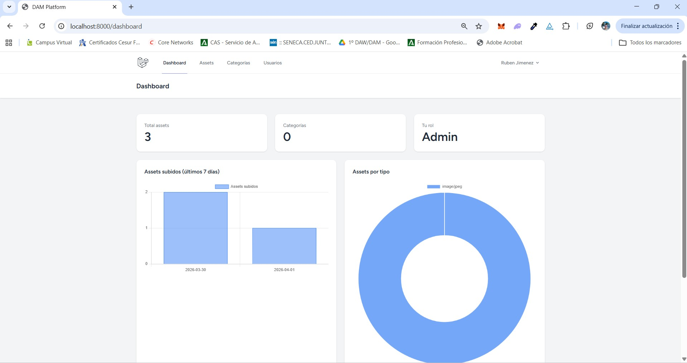

### Listado de assets con filtros

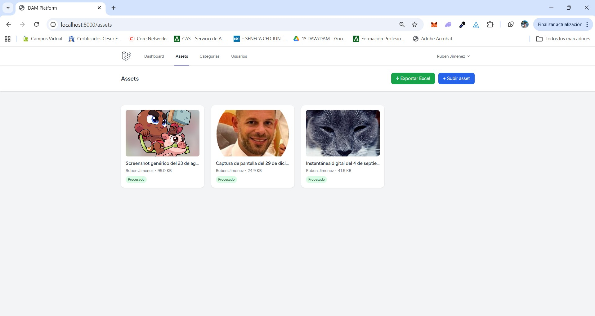

### ✨ Gemini Vision — Análisis visual real de imágenes

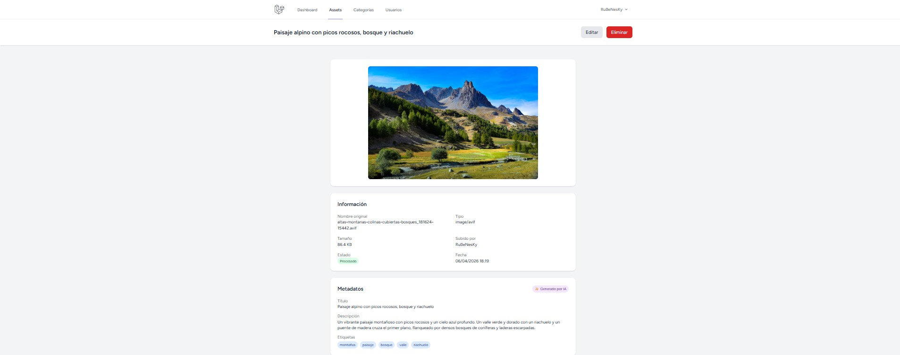

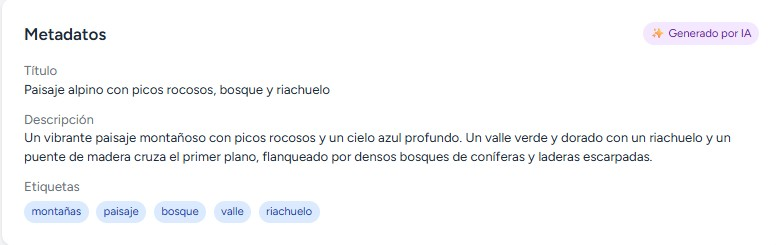

### ✨ Gemini Vision — Otro ejemplo

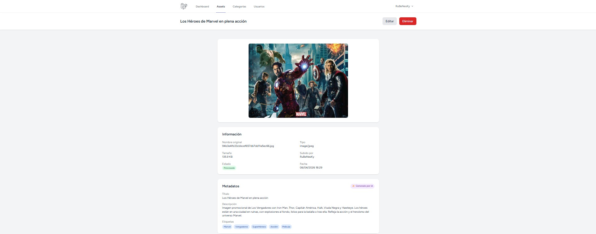

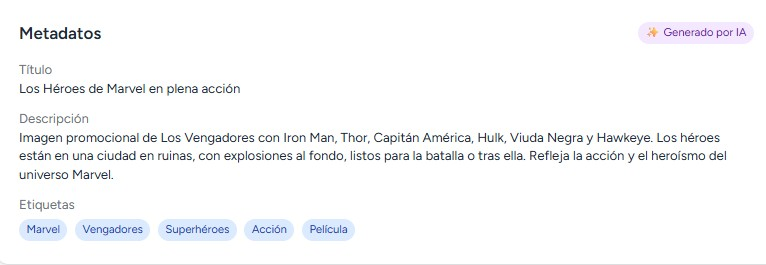

### Vista detalle con metadatos generados por IA

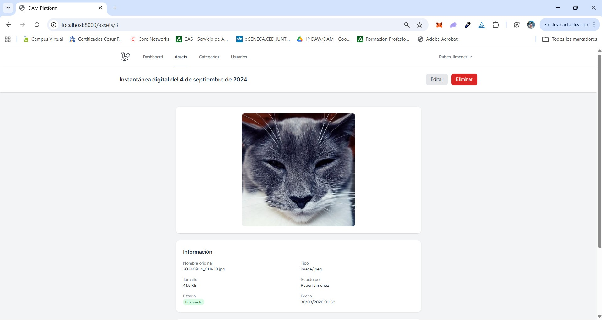

### Panel de administración de usuarios

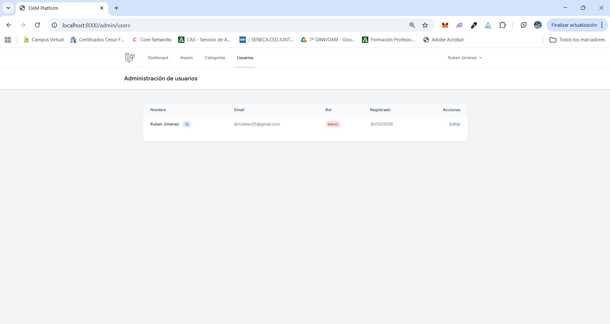

### Gestión de categorías

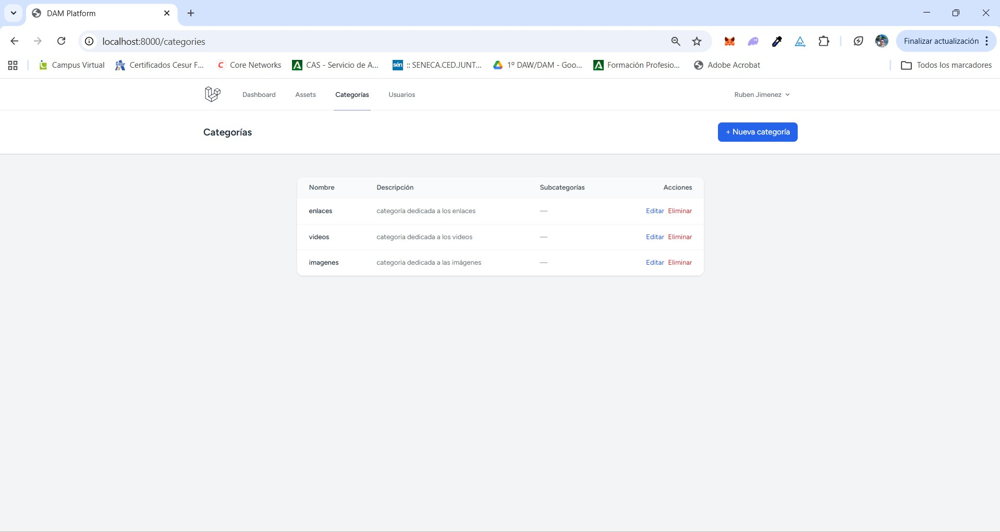

### API REST en Postman

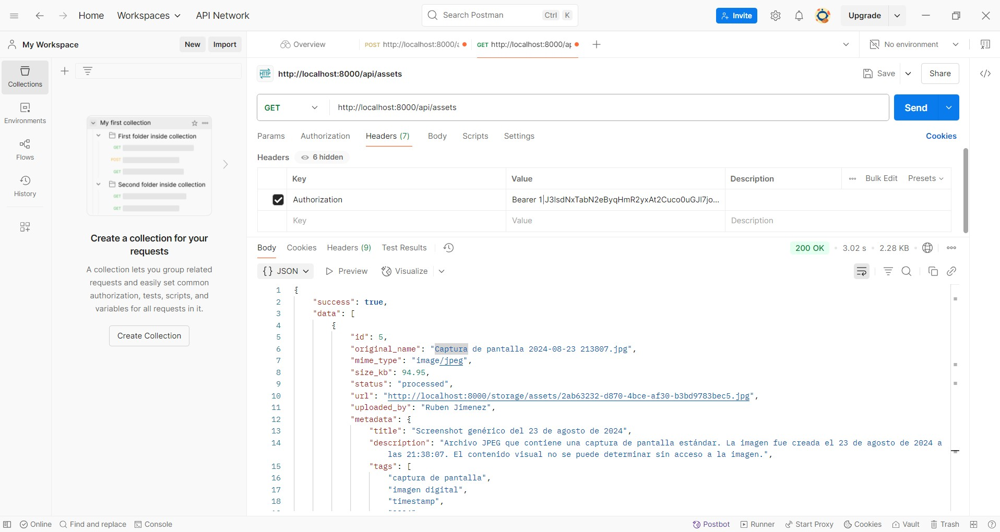

### Exportación a Excel

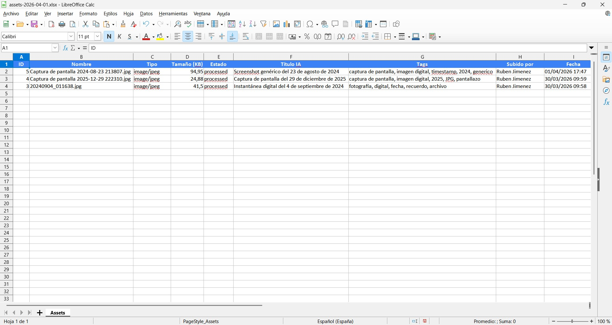

### 🤖 RAG — Chat con la base de datos

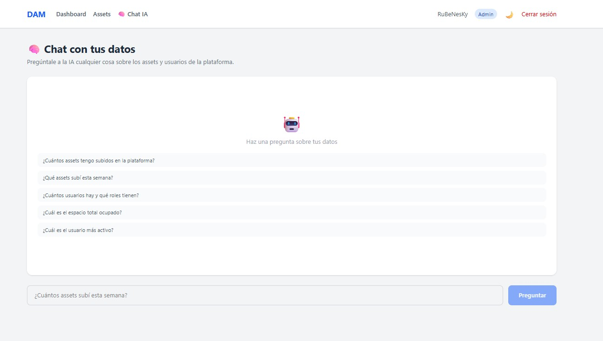

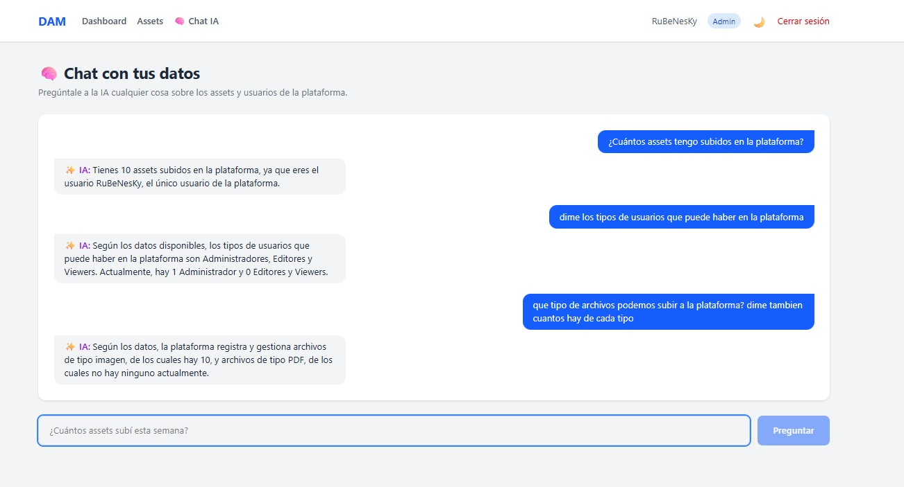

## 🛠️ Stack tecnológico

| Capa                 | Tecnología                       |
| -------------------- | -------------------------------- |
| Backend              | Laravel 10 (PHP 8.1)             |
| Frontend             | Blade + Alpine.js + Tailwind CSS |
| Base de datos        | MySQL                            |
| Autenticación API    | Laravel Sanctum                  |
| IA                   | Google Gemini API                |
| Gráficos             | Chart.js                         |
| Tests                | PHPUnit                          |
| Control de versiones | Git + GitHub                     |

## ⚙️ Instalación local

### Requisitos previos

- PHP 8.1+
- Composer
- MySQL
- Node.js y npm

### Pasos

```bash
# 1. Clonar el repositorio
git clone https://github.com/Rubenesky/dam-platform.git
cd dam-platform

# 2. Instalar dependencias PHP
composer install

# 3. Instalar dependencias JS
npm install

# 4. Copiar el archivo de entorno
cp .env.example .env

# 5. Generar la clave de la aplicación
php artisan key:generate

# 6. Configurar la base de datos en .env
DB_DATABASE=dam_platform
DB_USERNAME=root
DB_PASSWORD=

# 7. Añadir la API key de Gemini en .env
GEMINI_API_KEY=tu_api_key

# 8. Ejecutar migraciones
php artisan migrate

# 9. Crear enlace simbólico para storage
php artisan storage:link

# 10. Compilar assets
npm run dev

# 11. Arrancar el servidor
php artisan serve
```

## 🔐 Roles y permisos

| Acción               | Admin | Editor | Viewer |
| -------------------- | ----- | ------ | ------ |
| Ver assets           | ✅    | ✅     | ✅     |
| Subir assets         | ✅    | ✅     | ❌     |
| Editar assets        | ✅    | ✅     | ❌     |
| Borrar assets        | ✅    | ❌     | ❌     |
| Gestionar categorías | ✅    | ❌     | ❌     |
| Gestionar usuarios   | ✅    | ❌     | ❌     |
| Acceso a API         | ✅    | ✅     | ✅     |

## 🤖 Integración con IA — Tres sistemas Gemini trabajando juntos

### 1. Gemini Vision — Análisis visual real de imágenes

Al subir una imagen, la IA analiza el **contenido visual real**, no el nombre del archivo. Describe objetos, colores, estilos y contexto.

**Ejemplo real:**

- Archivo: `altas-montanas-colinas-cubiertas-bosques.avif`
- Título generado: _"Paisaje alpino con picos rocosos, bosque y riachuelo"_
- Descripción: _"Un vibrante paisaje montañoso con picos rocosos y un cielo azul profundo..."_
- Tags: `montañas`, `paisaje`, `bosque`, `valle`, `riachuelo`

### 2. Gemini NL2Query — Búsqueda por lenguaje natural

El usuario escribe en lenguaje humano y la IA convierte la búsqueda en filtros estructurados de base de datos.

**Ejemplos:**

- _"muéstrame imágenes de montañas"_ → `{type: image, search: montaña}`
- _"pdfs subidos esta semana"_ → `{type: application/pdf, date_from: 2026-03-30}`
- _"imágenes procesadas de paisajes"_ → `{type: image, search: paisaj, status: processed}`

Endpoint: `POST /api/search` con `{"query": "tu búsqueda en lenguaje natural"}`

### 3. Sistema de detección de duplicados — Dos niveles

**Nivel 1 — Hash MD5 (instantáneo):**
Si alguien sube el mismo archivo exacto, se detecta al 100% por su hash MD5 sin gastar ninguna petición a la IA. El archivo se rechaza automáticamente.

**Nivel 2 — IA semántica (Gemini):**
Si el archivo es diferente pero el contenido es similar (> 70%), Gemini lo detecta comparando descripciones y tags. El archivo se sube pero se avisa al usuario.

### 4. Gemini AI Variants — Generador de variantes y sugerencias

Desde la vista de cualquier asset el usuario puede pedir a la IA que genere sugerencias de mejora de los metadatos:

- **3 títulos alternativos** más SEO-friendly y descriptivos
- **2 descripciones mejoradas** más atractivas y detalladas
- **5 tags adicionales** relevantes no incluidos en los actuales

Las sugerencias son interactivas — el usuario puede aplicar cualquiera con un clic sin necesidad de editar manualmente. Los tags se añaden directamente a los metadatos existentes.

**Ejemplo real:**

- Título actual: _"Valle alpino con río turquesa y montañas nevadas"_
- Sugerencias: _"Valle Alpino: Río Turquesa y Picos Nevados"_, _"Paisaje Montañoso con Río Glaciar Turquesa"_
- Tags adicionales sugeridos: `glaciar`, `picos nevados`, `coníferas`, `escénico`, `aire libre`

### 5. RAG — Chat con tu base de datos en lenguaje natural

Tecnología utilizada por Google, Microsoft y OpenAI internamente. El usuario puede hacer preguntas en lenguaje natural sobre los datos reales de la plataforma y la IA responde consultando la base de datos.

**Ejemplos reales:**

- _"¿Cuántos assets tengo subidos?"_ → _"Tienes 10 assets subidos en la plataforma."_
- _"¿Qué assets subí esta semana?"_ → _"Esta semana subiste: 'Kirkjufell y Kirkjufellsfoss...', 'Paisaje Alpino...'"_
- _"¿Cuál es el usuario más activo?"_ → _"El usuario más activo es RuBeNesKy con 10 assets subidos."_
- _"¿Cuánto espacio ocupan los assets?"_ → _"El espacio total ocupado es de 1.35 MB."_

La IA no inventa datos — consulta la base de datos real en tiempo real y responde únicamente con información verificada.

Endpoint: `POST /api/rag` con `{"question": "tu pregunta en lenguaje natural"}`

### Metadatos generados automáticamente

- **Título** descriptivo (máximo 60 caracteres)
- **Descripción** detallada (máximo 200 caracteres)
- **Etiquetas** relevantes en español (3-5 tags)

El usuario puede editar los metadatos. Los generados por IA se marcan con ✨ en la interfaz.

Esta tecnología es similar a la que usan plataformas como Freepik internamente para indexar millones de recursos digitales.

## 🌐 API REST

La API usa autenticación por token con Laravel Sanctum.

### Autenticación

```http
POST /api/login
Content-Type: application/json

{
    "email": "usuario@ejemplo.com",
    "password": "contraseña"
}
```

Respuesta:

```json
{
    "success": true,
    "token": "1|abc123...",
    "user": {
        "id": 1,
        "name": "Nombre",
        "email": "usuario@ejemplo.com",
        "role": "admin"
    }
}
```

### Endpoints disponibles

| Método | Endpoint           | Descripción                   |
| ------ | ------------------ | ----------------------------- |
| POST   | `/api/login`       | Obtener token de acceso       |
| POST   | `/api/logout`      | Cerrar sesión                 |
| GET    | `/api/user`        | Datos del usuario autenticado |
| GET    | `/api/assets`      | Listar assets (paginado)      |
| GET    | `/api/assets/{id}` | Ver un asset                  |
| DELETE | `/api/assets/{id}` | Eliminar un asset             |

### Ejemplo de petición autenticada

```http
GET /api/assets
Authorization: Bearer 1|abc123...
```

Respuesta:

```json
{
    "success": true,
    "data": [
        {
            "id": 1,
            "original_name": "imagen.jpg",
            "mime_type": "image/jpeg",
            "size_kb": 24.88,
            "status": "processed",
            "url": "http://localhost:8000/storage/assets/uuid.jpg",
            "uploaded_by": "Nombre Usuario",
            "metadata": {
                "title": "Título generado por IA",
                "description": "Descripción generada por IA",
                "tags": ["tag1", "tag2"],
                "ai_generated": true
            },
            "categories": [],
            "created_at": "2026-03-30T09:58:58.000000Z"
        }
    ],
    "meta": {
        "total": 1,
        "per_page": 15,
        "current_page": 1,
        "last_page": 1
    }
}
```

## 🧪 Tests

```bash
# Ejecutar todos los tests
php artisan test

# Ejecutar solo los tests de assets
php artisan test --filter AssetTest
```

## 📁 Estructura del proyecto

```
app/
├── Http/
│   ├── Controllers/
│   │   ├── Admin/UserController.php
│   │   ├── Api/AssetApiController.php
│   │   ├── Api/AuthApiController.php
│   │   ├── AssetController.php
│   │   ├── CategoryController.php
│   │   └── DashboardController.php
│   └── Middleware/
│       └── CheckRole.php
├── Models/
│   ├── ActivityLog.php
│   ├── Asset.php
│   ├── AssetMetadata.php
│   ├── Category.php
│   └── User.php
├── Services/
│   └── GeminiService.php
└── Traits/
    └── LogsActivity.php
database/
└── migrations/
    ├── create_assets_table.php
    ├── create_asset_metadata_table.php
    ├── create_categories_table.php
    ├── create_asset_category_table.php
    └── create_activity_log_table.php
```

## 👨‍💻 Autor

Desarrollado por **Rubén Jiménez Cebrián** como proyecto de portfolio para el módulo DAW.
